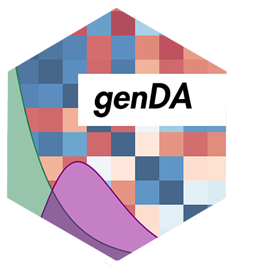

genDA 
======================================================

Multi-distributional Discriminant Analysis using Generalised Linear Latent Variable Modelling

Overview
--------

**genDA** is a Discriminant Analysis (DA) algorithm capable for use in multi-distributional response data - generalising the capabilities of DA beyond Gaussian response. It utilises *Generalised Linear Latent Variable Models (GLLVMs)* to capture the covariance structure between the different response types and provide an efficient classifier for such datasets. This package leverages the highly resourecful [TMB](https://github.com/kaskr/adcomp/wiki) package for fast and accurate gradient calculation in `C++`.

This package is part of a suite of discriminant analysis packages we have authored for large-scale/complex datasets. See also our package [multiDA](https://github.com/sarahromanes/multiDA), a statistical ML method for high dimensional, Gaussian data, with feature selection.


Installation
--------

```r
# Install the development version from GitHub:
# install.packages("devtools")
devtools::install_github("sarahromanes/genDA")

```

## Authors

* **Sarah Romanes**  - [@sarah_romanes](https://twitter.com/sarah_romanes)
* **John Ormerod**   - [@john_t_ormerod](https://twitter.com/john_t_ormerod)

## License

This project is licensed under the GPL-2 license.


## Acknowledgements

* I am grateful to everyone who has provided thoughtful and helpful comments to support me in this project - especially Mark Greenaway for C++ implementation!
* James Campbell for his incredibly valuable [post](https://rtbecard.gitlab.io/2018/02/11/Distributing-TMB-in-R-packages.html) describing how to compile an R package distributing multiple TMB scripts.
